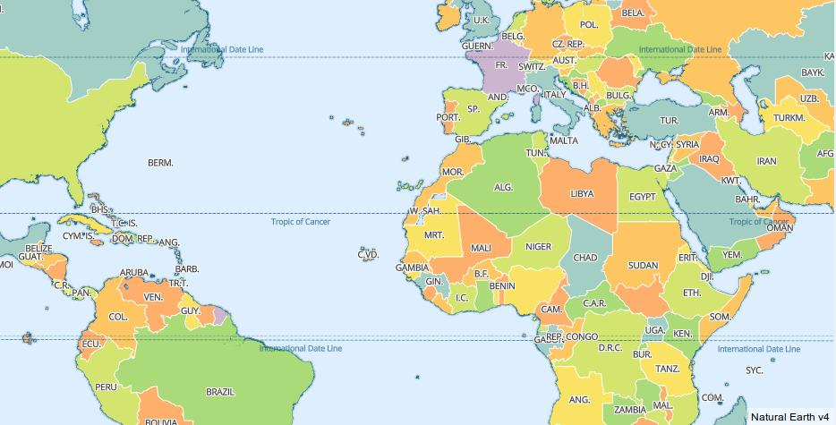

MVT Benchmark
=============

Benchmark for MVT vector tile creation and delivery from a PostGIS database.

The benchmark uses a minimal subset of the [NaturalEarth](http://www.naturalearthdata.com/) 4.1 data set.

Measurement targets:
* How long does it take to generate all tiles (single node / multiple nodes)
* How many requests/s does the tile server deliver in web server mode

Tileset definition
------------------

* Tileset name: `ne_countries`
* Maxzoom level for tile data: 6
* Tile size: 4096
* SRS (data and tiles): EPSG:3857 (Web Mercator)

Layer definition:

| Name               | Geom. type      | Buffer | Simplify | Table                                 | Attributes         | Conditions      |
|--------------------|-----------------|--------|----------|---------------------------------------|--------------------|-----------------|
| country            | MULTIPOLYGON    |   3    |   yes    | ne_10m_admin_0_countries              | adm0_a3, mapcolor7 | min_zoom <= {z} |
| country-name       | POINT           |   0    |   no     | ne_10m_admin_0_country_points         | abbrev, name       | -               |
| geo-lines (z=1..4) | MULTILINESTRING |   0    |   no     | ne_50m_geographic_lines               | name               | -               |
| geo-lines (z=5..6) | MULTILINESTRING |   0    |   no     | ne_10m_geographic_lines               | name               | -               |
| land-border        | MULTILINESTRING |   0    |   yes    | ne_10m_admin_0_boundary_lines_land    | -                  | min_zoom <= {z} |
| state              | MULTILINESTRING |   0    |   yes    | ne_10m_admin_1_states_provinces_lines | adm0_a3            | min_zoom <= {z} |

Display style
-------------

A reference Mapbox GL JS style for the produced tiles is [natural-earth-countries.json](maps/natural-earth-countries.json).

Screenshot:

Run benchmark
-------------

Requirements:
* Make
* Docker & docker-compose
* gnuplot

Quick benchmark:

    make quick_bench

Full benchmark:

    make bench

Graph:

    x-www-browser results/benchmark.jpg

Display map:

    docker-compose up nginx-t-rex

or

    docker-compose up nginx-ms

    x-www-browser http://localhost:8088

Avoid browser caching by using a private window in Firefox e.g.

Add a new software
------------------

* Copy the skeletion directory to a new directory named after your software
* Add a configuration for your software to create a tileset following the definition above
* Adapt the Makefile or add a script to run the benchmarks with your software, using docker containters, if possible
* Add calls to the project Makefile from the top level Makefile
* Open a pull request on Github

Reference database
------------------

The database can be started within a Docker container with

    docker-compose up -d mvtbenchdb

PostgreSQL is running on Port 5432 within Docker and is mapped to `127.0.0.1:5439` on the Docker host.

* DB user: `mvtbench`
* DB password: `mvtbench`

Connection example:

    PGPASSWORD=mvtbench psql -h 127.0.0.1 -p 5439 -U mvtbench

Local DB Setup
--------------

    # Set Postgresql environment variables when needed: PGHOST, PGPORT, PGUSER, PGPASSWORD
    cd data
    make createdb

Import GeoPackage with ogr2ogr:

    make gpkgrestore
